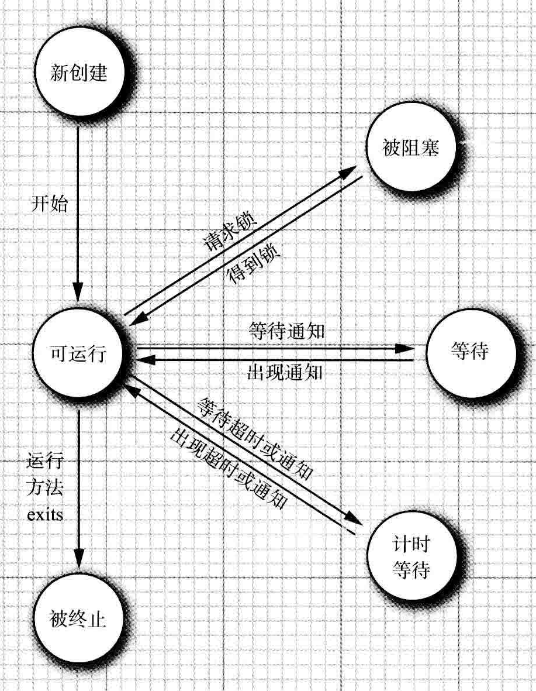
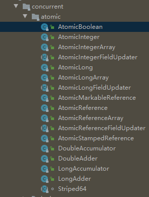

# java-concurrency-demo
Java并发训练Demo

[toc]

## 并发
- 多任务：在同一时刻运行多个程序的能力；
- 进程：独享变量，系统资源分配和调度的基本单位；
- 线程：共享数据；进程的一个实体，不独立存在；是进程的一个执行路径；（对比进程，线程之间通信更有效、更容易、更轻量级、开销少）

单独线程执行一个任务的简单过程
```

// 1.将任务代码移到实现Runnable接口的类的run方法中；
public interface Runnable {
    void run();
} 

// Runnable 是一个函数式接口，可使用lambda表达式建立一个实例
Runnable r = () -> {
    //task code
};

// 2.由Runnable创建一个Thread对象
Thread t = new Thread(r);

// 3.启动线程
t.start();

// 另一种方法
// 并不推介：因为并行运行的任务应该与运行机制解耦合；
class MyThread extend Thread {
    public void run() {
        // task code
    }
}

```

注意：不要直接调用Thread类或Runnable对象中的run()方法；因为直接调用，只会执行同一个线程中的任务，而不会启动新线程；应调用Thread.start()方法；

### 中断线程
-  线程终止：
    -  run()方法执行方法体中最后一条语句，并经由执行return语句返回；
    -  在方法中出现没有捕捉的异常；
    -  Java早期版本，stop()方法强制终止，现被弃用；
    -  interrupt()：请求终止线程；
        -  调用interrupt()：线程**中断状态**被置位(boolean)；
        -  判断当前线程是否被置位：Thread.currentThread().isInterrupted();
        -  若线程被阻塞（sleep或wait），就无法检测中断状态；若调用interrupt()则阻塞调用将会被InterruptedException 异常中断；
        -  中断意义：引起注意，被中断的线程可以决定如何响应中断；
        -  interrupted(): 静态方法，检测当前线程是否被中断；调用该方法会清除该线程的中断状态；
        -  isInterrupted(): 实例方法，检验是否有线程被中断；不会改变线程中断状态；
-  InterruptedException异常的处理：
    -  在catch字句中调用：Thread.currentThread().interrupt()来设置中断状态；
    -  直接抛出该异常： void mySubTask() throws InterruptedException {}
    
### 线程状态
+  New 新创建
+  Runnable 可运行
+  Blocked 被阻塞
+  Waiting 等待
+  Timed waiting 计时等待
+  Terminated  被终止

-  **新创建线程**： new Thread(r);线程被创建但未开始运行；状态为 New；

-  **可运行线程**： 一旦线程调用 start()方法，则该线程处于 Runnable 状态；
    -  Runnable 可运行：线程可能正在运行或者没有运行；这取决于操作系统给线程提供的运行时间；
    -  一旦线程开始运行，不必始终保持运行；
    -  运行中的线程被中断，目的让其他线程获取运行的机会；
    -  线程调度细节依赖操作系统提供的服务：
        -  抢占式调度： 给每一个可运行的线程一个时间片来执行任务；时间片用完，该线程的运行权被操作系统剥夺，并交给另一个线程运行（考虑线程的优先级）；
        -  协作式调度：一个线程只有调用 yield 方法，或者被阻塞或者等待时才失去控制权；
        
-  **被阻塞线程和等待线程**：线程暂时不活动，不运行任何代码且消耗最少资源；
    -  当线程获取一个被其他线程持有的内部锁，则该线程进入**阻塞状态**；当其他线程释放该锁，并且线程调度器允许本线程持有时，该线程将变成非阻塞状态；
    -  当线程等待另一个线程通知调度器一个条件时，该线程进入**等待状态**；（在调用 Object.wait()、Thread.join()、Lock、Condition时出现该情况）；
    -  方法中有一个超时参数，调用他们导致线程进入**计时等待状态**；该状态保持直至超时期满或接收到适合的通知；（带有超时参数方法：Thread.sleep、Object.wait、Thread.join、Lock.tryLock、Condition.await）;
        -  Thread.join(): 等待终止指定的线程；
        -  Thread.join(long millis): 等待指定的线程死亡或者经过指定的毫秒数；
        -  Thread.State getState(): 获取线程状态；
        
-  **被终止的线程**:
    - run 方法正常退出而自然死亡；
    - 一个没有被捕捉的异常终止了run方法二意外死亡；
    
{:height="50%" width="50%"}

### 线程属性
+  **线程优先级**：
    +  MIN_PRIORITY(1) - MAX_PRIORITY(10) 之间, NORM_PRIORITY(5) 默认优先级；
    +  setPriority方法可提高或降低线程的优先级；
    +  默认情况：一个线程继承父线程的优先级；
    +  线程调度器选择新线程，优先选择较高优先级的线程；
    +  static void yield(); 导致当前线程处于让步状态；
    
+  **守护线程**：
    +  t.setDaemon(true); 将线程转换为守护线程；（在线程启动之前调用）
    +  唯一用途： 为其他线程提供服务；

+  **处理未捕获异常的处理器**：
    +  线程run 方法中不能抛出任何受查异常，但非受查异常会导致线程终止；
    +  线程终止前，异常被传递到一个用于未捕获异常的处理器（必须实现 Thread.UncaughtExceptionHandler接口，该接口只有一个方法：void uncaughtException(Thread t, Throwable e）；
        +  setUncaughtExceptionHandler：为任何线程安装处理器；
        +  或 Thread.setDefaultUncaughtExceptionHandler: 为所有线程安装一个默认处理器；
        +  替换处理器可以使用日志API发送未捕获异常的报告到日志文件；
        +  若不安装处理器，则默认处理器为空；但不为独立的线程安装处理器，此时的处理器就是该线程的ThreadGroup对象（线程组）；
            +  线程组是一个可以统一管理的线程集合；
            +  默认情况，创建的所有线程属于相同线程组；
            +  ThreadGroup类实现 Thread.UncaughtExceptionHandler接口，uncaughtException方法如下操作：
                +  若线程组有父线程组，那么父线程的uncaughtException方法被调用；
                +  否则，若Thread.getDefaultExceptionHandler方法返回一个非空处理器，则调用该处理器；
                +  否则，如果Throwable是ThreadDeath的一个实例，什么不做；
                +  否则，线程名字以及Throwable的栈轨迹被输出到System.err上；

### 同步

+  竞争条件：两个或两个以上线程需要共享对同一数据的存取；  
+  同步的意义：避免多线程引起的对共享数据的讹误；
+  [竞争条件的一个例子](./src/main/java/unsynch/UnsynchBankTest.java)
+  **锁对象**
    +  synchronized关键字：自动提供一个锁以及相关的“条件”；（隐式）
    +  ReentrantLock类：一个可以用来保存临界区的可重入锁；（可重入锁：lock-unlock相对应，锁可叠加）（显式）
```
// 锁确保任何时刻只有一个线程进入临界区，保护代码片段
Lock myLock = new ReentrantLock();
myLock.lock(); // 当一个线程封锁了锁对象，其他任何线程都无法通过lock语句；其他线程调用lock时被阻塞，直至其他线程释放锁对象；
try {

} finally {
    myLock.unlock();
}
```
+  **[条件对象（条件变量）](./src/main/java/synch/Bank.java)**：管理那些已获得锁却需要某一条件满足后才执行的线程；（高度的锁定控制，大多数情况下并不需要这样的控制）
    +  一个锁对象可以有一个或多个相关的条件对象；
    +  Condition xCondition = myLock.newCondition()方法获取一个条件对象；习惯上条件对象命名反映其表达的条件意义；
    +  若某个条件不满足，则调用xCondition.await()方法阻塞该线程，并放弃锁；
    +  等待获取锁和调用await()方法的线程的区别：
        1.  线程调用await()方法，该线程进入该条件等待集；
        2.  当锁可用时，该线程**不能马上解除阻塞（区别）**；
        3.  直至另一个线程调用同一条件上的**signalAll()方法**为止（重新激活因为这一条件而等待的所有线程），该线程由**阻塞状态**转至**可运行状态**；
            +  另一个方法：signal()是**随机解除**等待及中某个线程的阻塞状态，比解除所有线程的阻塞更有效，但存在风险，易出现死锁；
        4.  当调度器再次激活该线程，一旦锁成为可用的，那么该线程将从await()调用返回，从被阻塞的地方继续执行；
        5.  若无其他线程重新激活等待的线程，那么等待的线程将永远不再运行，导致出现死锁现象；
    +  await()方法返回：
        +  被另一个线程调用 signalAll / signal 激活；
        +  超时时限已到；【等待条件也可以设置一个超时参数：myCondition.await(100, TimeUnit.MILLISECONDS);】
        +  线程被中断；（await方法将抛出一个InterruptedException异常）（若希望此时线程继续等待，可用awaitUninterruptibly()方法代替await）

+  **synchronized关键字**（嵌入Java语言内部的机制）
    +  Java中每个对象都有一个内部锁；若方法使用synchronized关键字声明，那么对象的锁将保护整个方法；
    +  内部对象锁只有一个相关条件；
        +  wait()：添加一个线程到等待集中；
        +  notifyAll()/notify()：解除等待线程的阻塞状态；
    +  静态方法声明为synchronized也是合法的；
    +  内部锁和条件存在的局限：
        +  不能中断一个正在试图获得锁的线程；
        +  试图获得锁是不能设定超时；
        +  每个锁仅有单一的条件，可能是不够的；
        
+  Lock/Condition和synchronized使用建议：
    1.  两者均不使用；在许多情况下使用java.util.concurrent包中的一种机制，它会为你处理所有加锁；
    2.  synchronized关键字适合，尽量使用它，可减少编写的代码数量，减少出错几率；
    3.  若需要Lock/Condition结构提供的独有时，才使用它；
    
+  同步阻塞
    +  形式：synchronized(obj) {}
    +  客户端锁定：使用一个对象的锁来实现额外的原子操作；  
```
public synchronized void method() {}
// 等价于
public void method() {
    this.intrinsicLock.lock();
    try {
        // method body
    } finally {
        this.intrinsicLock.unLock();
    }
}

```
+  监视器概念：不需考虑如何加锁就可以保证多线程的安全性；
    +  监视器特性：
        +  监视器只包含私有域的类；
        +  每个监视器类的对象有一个相关的锁；
        +  使用该锁对所有方法进行加锁；
        +  该锁可以有任意多个相关条件；
        
+  Volatile域：为实例域的同步访问提供一种免锁机制；（但Volatile变量不能提供原子性，不能保证读取、翻转和写入不被中断）
+  final 变量
+  原子性：
    +  若对共享变量仅进行赋值，那么可以将这共享变量声明为volatile;
    +  java.util.concurrent.atomic包中有很多类使用了高效的机器级指令（而不是锁）来保证其他操作的原子性；
        +  AtomicInteger类：
            +  incrementAndGet: 以原子的方式自增
            +  decrementAndGet：以原子的方式自减
    
    
    
+  死锁
+  线程局部变量：
    +  ThreadLocal辅助类为各个线程提供各自的实例，避免共享变量的风险；
    
```
// 实例一
public static final SimpleDateFormat dateFormat = new SimpleDateFormat("yyyy-MM-dd");
// 若多个线程都执行, 结果可能很混乱；并发访问可能破坏dateFormat使用的内部数据结构，若使用同步的话开销很大
String dateStamp = dateFormat.format(new Date());

// 为每个线程构建实例
public static final ThreadLocal<SimpleDateFormat> dateFormat 
                       = ThreadLocal.withInitial(() -> new SimpleDateFormat("yyyy-MM-dd"));
String dateStamp = dateFormat.get().format(new Date());

// 实例二
// 生成随机数
int random = ThreadLocalRandom.current().nextInt(upperBound);
```
+  锁测试与超时
    +  当线程调用lock方法获取被另一个线程持有的锁，该线程很可能发生阻塞；->谨慎申请锁：tryLock()方法试图申请一个锁；
        +  tryLock()：视图申请锁；（此方法会抢夺可用锁）
        +  tryLock(x, TimeUnit.x)：使用超时参数；
            +  TimeUnit 枚举类型
                +  SECONDS
                +  MILLISECONDS
                +  MICROSECONDS
                +  NANOSECONDS
        +  lockInterruptibly：tryLock无限超时方法
    +  lock()方法不能被中断;
        +  若线程在tryLock时被中断，那么中断线程在获得锁之前一直处于阻塞状态；（若出现死锁，lock方法无法终止）
        +  若线程调用带超时参数的tryLock获取锁，在等待期间被中断，那么将抛出InterruptedException异常；
+  读/写锁
    +  java.util.concurrent.locks包中定义两个锁类：
        +  ReentrantLock类
        +  ReentrantReadWriteLock类（适用于多读取少修改）
            +  使用读写锁的步骤：
                1.  构建一个ReentrantReadWriteLock对象： ReentrantReadWriteLock rw1 = new ReentrantReadWriteLock();
                2.  抽取读锁和写锁：
                    +  读锁：Lock readLock = rw1.readLock();
                    +  写锁：Lock writeLock = rw1.writeLock();
                3.  对所有的获取方法加读锁：readLock.lock(); try{}finally{readLock.unlock();}
                4.  对所有的修改方法加写锁：writeLock.lock(); try{}finally{writeLock.unlock();}    
+  弃用stop和suspend方法原因：  
    +  stop：终止一个线程；->不安全
    +  suspend：阻塞一个线程直至另一个线程调用resume()；->易导致死锁
    +  共同点：试图控制线程的行为； 

### 阻塞队列
+  线程问题，可以使用一个或多个**队列**以优雅且安全的方式将其形式化；（安全传输数据）（不需要同步）
+  生产者线程向队列插入元素，消费者线程则取出；
+  阻塞队列方法：
    +  add：添加一个元素；若队满，则抛出IllegalStateException异常；
    +  element：返回队列的头元素；若队列空，则抛出NoSuchElementException异常；
    +  offer：添加一个元素并返回true；若队满，则返回false；
    +  peek：返回队列的头元素；若队空，则返回null；
    +  poll：移除并返回队列头元素；若队空，则返回null；
    +  put：添加一个元素；若队满则阻塞；
    +  remove：移除并返回头元素；若队空则抛出NoSuchElementException异常；
    +  take：移除并返回头元素；若队空则阻塞；
    
    +  总结：
        +  按功能划分：
            +  添加：
                +  add：队满抛IllegalStateException异常
                +  offer：队满返回false
                +  put：队满阻塞
            +  返回队列头元素
                +  element：队空抛NoSuchElementException异常
                +  peek：队空返回null
            +  移除并返回队列头元素
                +  remove：队空抛NoSuchElementException异常
                +  poll：队空返回null
                +  take：队空阻塞
        +  按响应方式划分
            +  将队列作为线程管理工具：put/take
            +  向满队列添加或向空队列移出元素(抛出异常)：add/remove/element
            +  提示错误：offer/poll/peek(可带超时参数)
+  java.util.concurrent包中提供的阻塞队列：
    +  LinkedBlockingQueue: 容量没有上边界，但可指定最大容量；
    +  LinkedBlockingDeque: 双端版本；
    +  ArrayBlockingQueue: 构造时需指定容量，并且有一个可选参数来指定是否需要公平性（等待时间长的线程优先处理，但降低性能）；[demo](./src/main/java/blockingQueue/BlockingQueueTest.java)
    +  PriorityBlockingQueue: 带优先级的队列；没有容量上限；
    +  DelayQueue: 实现Delayed接口的对象；包含Delayed元素的无界阻塞时间有限的阻塞队列；延时已超过时间的元素可以从队列中移除；
    +  TransferQueue接口: 允许生产者线程等待，直到消费者可以接收元素；
        +  void transfer(E element);
        +  boolean tryTransfer(E element, long time, TimeUnit unit);
        +  传输一个值，或者尝试在超时时间内传输这个值，这个调用将阻塞，直到另一个线程将元素删除；
    +  LinkedTransferQueue: 实现了TransferQueue接口；

### 线程安全的集合
+  可通过锁来保护共享数据结构；
+  java.util.concurrent包中的高效的映射、集和队列：
    +  ConcurrentHashMap：可被多线程安全访问的散列映射表；（可指定初始化容量、负载因子和并发写者线程的估计数）
    +  ConcurrentSkipListMap：可被多线程安全访问的有序的映射表；
    +  ConcurrentSkipListSet：可被多线程安全访问的有序集；
    +  ConcurrentLinkedQueue：可被多线程安全访问的无边界非阻塞的队列；
+  弱一致性迭代器：不一定反映出被构造之后的所有修改，发生改变也不会抛出ConcurrentModificationException异常(区别);
+  并发散列映射表（ConcurrentHashMap）：
    +  可高效地支持大量的读者和一定数量的写者（默认情况下有16个写者线程同时执行，多于16则其他线程暂时被阻塞）；
    +  将相同散列码的所有条目放在同一个“桶”中，并发散列映射将桶组织为**树**，而不是列表，键类型实现了Comparable；
+  映射条目的原子更新
```
// 示例：统计单词出现的次数
// 线程不安全
Long oldValue = map.get(word);
Long newValue = oldValue == null ? 1 : oldValue + 1;
map.put(word, newValue);

// 传统做法：使用replace操作：以原子方式用新值替换原值（前提条件是没有其他线程把原值替换为其他值）
do {
    oldValue = map.get(word);
    newValue = oldValue == null ? 1 : oldValue + 1;
} while(!map.replace(word, oldValue, newValue);

// 可使用ConcurrentHashMap<String, AtomicLong>
// 或使用 ConcurrentHashMap<String, LongAdder>
// putIfAbsent:返回映射的值（可能是原来的值，或者是新设置的值）
map.putIfAbsent(word, new LongAdder()); // 确保longAdder可以完成原子自增
word.get(word).increment();

// Java SE8新特性
map.compute(word, (k, v) -> v == null ? 1 : v + 1);

// computeIfPresent和computeIfAbsent，分别在已经有原值的情况下计算新值或者没有原值的情况下计算新值；
map.computeIfAbsent(word, k -> new LongAdder()).increment();

// 首次加键需特殊处理-merge：有参数表示键不存在时使用初始值
map.merge(word, 1L, (existingValue, newValue) -> existingValue + newValue);
// 等效
map.merge(word, 1L, Long::sum);
```

+  对并发散列映射的批操作
    +  批操作会遍历映射，处理遍历过程中找到的元素；
        +  散列映射不被修改：无需冻结当前映射的快照；
        +  被修改： 把结果当作映射状态的近似；
    +  三种操作：
        +  搜索（search）：为每个键或值提供一个函数，直至函数生成一个非null的结果；
            + U searchKeys(long threshold, BiFunction<? super K, ? extents U> f);
            + U searchValues(long threshold, BiFunction<? super K, ? extents U> f);
            + U search(long threshold, BiFunction<? super K, ? extents U> f);
            + U searchEntries(long threshold, BiFunction<? super K, ? extents U> f);
        +  归约（reduce）：组合所有键或值；
        +  foreach：为所有键和值提供一个函数；
    +  每个操作都有4个版本：
        +  operationKeys：处理键；
        +  operationValues：处理值；
        +  operation：处理键和值；
        +  operationEntries：处理Map.Entry对象；
        +  各个操作均需要指定一个**参数化阈值**，映射包含元素多于这个阈值，就并行完成批操作；
        
```
// 找出第一个出现次数超过1000次的单词
String result = map.search(threshold, (k, v) -> v > 1000 ? k : null);

// forEach方法有两种形式
// 1.只为各个映射条目提供一个消费者函数
map.forEach(threshold, (k, v) -> System.out.println(k + " -> " + v));
// 2. 提供一个消费者函数和一个转换器函数
map.forEach(threshold, 
    (k, v) -> k + " ->" + v,  // Transformer
    System.out::println); // Consumer
//  转换器也可当作一个过滤器
map.forEach(threshold, 
    (k, v) -> v > 1000 ? k + " ->" + v : null,  // Filter and Transformer
    System.out::println); // Consumer

// reduce操作用一个累加函数组合其输入；若映射为空，则所有条目被过滤掉，仅返回null；若只有一个元素，则返回其转换结果，不会应用到累加器；
Long sum = map.reduceValues(threshold, Long::sum); // 计算所有值的总和
// 可提供一个转换器函数
Long maxlength = map.reduceKeys(threshold, String::length, Integer::max); //计算最长的键长度
// 转换器也可以作一个过滤器
Long count = map.reduceValues(threshold, v -> v > 1000 ? 1L : null, Long::sum); // 统计多少条目的值大于1000
```

+  并发集视图
    +  线程安全的集：ConcurrentHashSet类（不存在）——> 使用ConcurrentHashMap代替（包含假值） ——> 得到一个映射而不是集，不能应用Set接口的操作；
    +  newKeySet方法：生成一个Set<K>，实际上是ConcurrentHashMap<K, Boolean>的一个包装器；
    +  若存在一个映射：
        +  keySet方法：生成这个映射的键集；（该集可变）
            +  若删除键集的元素，那么在映射中这个键以及值也会删除；
            +  不能往键集增加元素，因为没有对应的值可以增加；
+  写数组拷贝
    +  CopyOnWriteArrayList
    +  CopyInWriteArraySet
        +  线程安全集合，所有修改线程对底层数组进行复制；

+  并行数据算法
    +  Arrays类提供大量并行化操作：
        +  Arrays.parallelSort()方法可以对一个基本类型值或对象的数组排序；
            +  可提供一个Comparator：Arrays.parallelSort(words, Comparator.comparing(String::length));
            +  可提供一个边界范围：Arrays.parallelSort(words.length / 2, words.length);
        +  parallelSetAll()方法：由一个函数计算得到的值填充一个数组；
        +  parallelPrefix()方法：用对应一个给定结合操作的前缀的累加结果替换各个数组元素；

+  较早的线程安全集合
    +  Vector: 早期线程安全动态数组的实现；——>现被ArrayList类代替（但不是线程安全）——>可使用同步包装器使线程安全；
        +  List<E> synchArrayList = Collections.synchronizedList(new ArrayList<E>());
    +  Hashtable: 早期线程安全散列表的实现；——>现被HashMap类代替（但不是线程安全）——>可使用同步包装器使线程安全；
        +  Map<K, V> synchHashMap = Collections.synchronizedMap(new HashMap<K, V>());
    +  使用同步包装器，使集合的方法使用锁加以保护，提供了线程安全的访问；
    +  当另一个线程进行修改时要对集合进行迭代，任然需要“客户端”锁定：
    +  若在迭代的过程中，别的线程修改集合，那么迭代器会失效，抛出ConcurrentModificationException异常；
```
synchronized(syschHashMap) {
    Iterator<K> iter = synchHashMap.keySet().iterator();
    while (iter.hasNest()) {
        // ……
    }
}
```

### Callable与Future
+  Runnable：封装一个异步运行的任务，没有参数和返回值；
+  Callable：与Runnable相似，但有返回值；Callable 接口是一个参数化类型，只有一个方法call;
+  Future：保存异步计算结构；
    +  Future接口
    +  FutureTask包装器：可将Callable转换成Future和Runnable;[demo](./src/main/java/future/FutureTest.java)

```java
// Future 接口
public interface Future<V> {
    // 若运行计算的线程被中断，那么将抛出InterruptedException异常；
    V get() throws Exception; // 调用被阻塞，直至计算完成；
    V get(long timeout, TimeUnit unit) throws Exception; // 计算完成之前调用超时，抛出TimeoutException异常；
    void cancel(boolean mayInterrupt);
    boolean isCancelled();
    boolean isDone();
}
```

### 执行器
+  线程池：
    +  构建新线程有一定代价，因为涉及到操作系统的交互；若需大量切生命期很短的线程，应使用线程池；——>提高执行任务的效率，可减少并发线程的数目；
    +  一个线程池有许多准备运行的空闲线程；
    +  执行器Executors：有许多静态工厂来构建线程池；
        +  newCachedThreadPool：必要时创建新线程；空闲线程被保留60秒；
        
        +  newFixedThreadPool：该池包含固定数量的线程；空闲线程被一直保留；
            +  若提交的任务数 > 空闲的线程数：将得不到服务的任务放至到队列中，当其他任务完成后再运行；
            
        +  newSingleThreadExecutor：只有一个线程，线程执行顺序为任务提交的顺序；
        
        +  newScheduledThreadPool：用于预定执行而构建的固定线程，代替java.util.Timer;
        
        +  newSingleThreadScheduledExecutor：用于预定执行而构建的单线程池；
        
    +  结束线程池：
        + shutdown：启动该池的关闭序列；被执行的执行器不再接受新任务，直至所有任务完成后，线程池的线程死亡；
        + shutdownNow：该池取消尚未开始的所有任务和试图中断正在运行的线程；
        
    +  线程池使用步骤：[demo](./src/main/java/threadPool/ThreadPoolTest.java)
        1.  调用 Executors 类中静态的方法：newCachedThreadPool 或 newFixedThreadPool;
        2.  调用 submit 提交 Runnable 或 Callable 对象；
        3.  若要取消一个任务，或如果提交 Callable 对象，需要保存好提交返回的 Future 对象；
        4.  当不再提交任何任务的时候，调用 shutdown ；
    
```
//  newCachedThreadPool、newFixedThreadPool、newSingleThreadPool
//  返回实现了ExecutorService接口的ThreadPoolExecutor类对象

//  将Runnnabe或Callable对象提交给ExecutorService,Future对象用于查询该任务的状态；
Future<?> submit(Runnable task); // 完成后调用get只返回null
Futrue<?> submit(Runnable task, T result); // 完成后调用get返回指定的result对象
Futute<?> submit(Callable<T> task);
```
+  预定执行
    +  ScheduledExecutorService 接口为预定执行或重复执行任务而设计；使用线程机制的java.util.Timer的泛化；
    +  Executors 执行器类
        +  返回实现了 ScheduledExecutorService 接口的对象；
        
        +  newScheduledThreadPool：包含固定数量的线程；
        
        +  newSingleThreadScheduledExecutor：该执行器中在单独一个线程中调度任务；
        
```
// 预定在指定时间之后执行任务
ScheduledFuture<V> schedule(Callable<V> task, long time, TimeUnit unit);
ScheduledFuture<?> schedule(Runnable task, long time, TimeUnit unit);

// 预定在初始的延迟结束后，周期性地运行给定的任务，周期长度为 period
ScheduledFuture<?> scheduleAtFixedRate(Runnable task, long initialDelay, long period, TimeUnit time);

// 预定在初始的延迟结束后，周期性地运行给定的任务，在一次调用完成和下一次调用开始之间有长度为 delay 的延迟
ScheduledFuture<?> scheduleWithFixedDelay(Runnable task, long initialDelay, long delay, TimeUnit time);
```

+  控制任务组

+  Fork-Join框架 [demo](./src/main/java/forkJoin/ForkJoinDemo.java)


